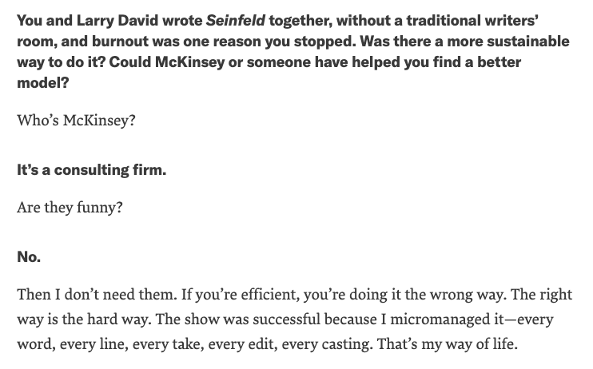

At OverEasy, we think a lot about the creative process. Every step of building a product requires creative thinking, from the initial ideation to the UI/UX design and branding to writing the code and deploying servers. The workings of a successful software companies look almost like the model of a movie studio, where dozens of domain experts — actors, directors, producers, editors, A&V, etc. — must pool their collective wisdom together to create a singular vision. Any incoherence in that vision, whether it’s a bland music score or an unbelievable performance is usually enough to ruin the end product.


This by the way is why both movies and software are industries where it’s surprisingly possible for small teams to upend billion dollar incumbents: creative work doesn’t scale. It can’t be synthesized into a 12 step process for Fortune 500 executives to post on LinkedIn or drilled into the minds of young McKinsey analysts.


Jerry Seinfeld on McKinsey (Source: HBR)

Creative work forces people to constantly pivot between painstakingly obsessing over small details and analyzing the big picture. It requires thinking critically about your own work, while also inspiring yourself to shoot for moonshot outcomes. Creative work is also very nonlinear: sometimes work done over an afternoon proves to be significantly more valuable than work done over 3 months.

Most company cultures fail to account for these nuances. Common metrics companies use like features shipped or hours committed fail to capture what actually makes the creative process tick. [1 more]. And don’t even get me fucking started on “agile” development processes which require people to chop their week up between twenty “stand-ups” and “check-ins” instead of them actually doing their jobs.

The best cultures embrace the paradoxes of creative work. The point of a culture shouldn’t be to fit people into neat, quantifiable boxes: it should be to get the best work done possible.

At OverEasy, we have a Side Hustle Culture. We understand that doing the best creative work does not mean doing the most creative work. A lot of the time the best way to deal with a roadblock is to drop it for a while and move over to a different project. Being able to easily switch between different projects is the only way to keep up with the momentum of a startup while still delivering quality work.

Part of Side Hustle Culture means being able to work on a couple different assignments at a time on OverEasy, but it also means being able to work on stuff completely outside of work. Jobs tend to narrow your lens on the world, which to creatives is very dangerous. It’s often insights or techniques from things totally outside of your day to day that give you the best ideas. And so, in order to do the best work at OverEasy, people need have room to work.

Everyone on our team at OverEasy has an external side hustle. I have this blog and my podcast, but we also have on our team someone writing a book and someone else speculating on marijuana themed domains in light of forthcoming state legalizations. [Note: tell me if you want to cut this reference to your work].

To be clear, this is not saying that people should always have very ambitious projects running concurrent with their professional work. In addition, there also definitely are some times in a startup where you have to focus yourself completely on the task at hand. But over the long term people we believe do their best work when they have an enjoyable life outside of work, both on a social level and on a creative level.

Tech Companies and Movie Studios have also gotten similar over the recent years as they — along with most industries in America — have consolidated into just a few massive players. People spend the majority of their time online interacting with products from FAANG, and it’s harder than it used to be for new products to get traction.

However, there is also an opportunity here. As FAANG have monopolized, they have failed to innovate. When’s the last time any of these companies came out with a product that’s as good as what brought them to success? Facebook has had every venture that it launched on its own flop. Google has tens of thousands of incredibly smart people working there but they still can’t release a good chat app. And so people who want to do their best work don’t stay very long anymore at FAANG, because they no longer have cultures that allow people to do their best work.

At OverEasy we aim to capitalize on that. We’re building a culture that attracts talented people to come work with us, not because we have ping pong tables or cold brew on tap, but because we genuinely care about helping them do their best work.
