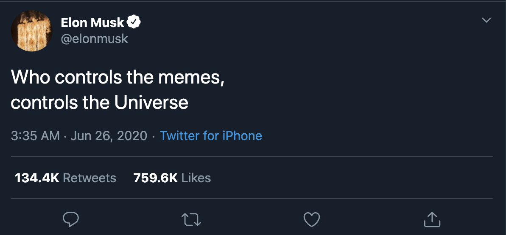

People think of memes as an internet phenomenon, but memes are as old as people are. Memes, as [defined in the 70s by Richard Dawkins](https://en.wikipedia.org/wiki/Meme#Dawkins), are just ideas that spread from person to person. The internal combustion engine is a meme, as is Apple Computers, the United States of America, and Christianity. Memes are our collective cultural conscious. They unite us and they divide us.

While the internet didn’t invent memes, it did pour gasoline on them. The web is a whole substrate of society that primarily runs on memes. In cyberspace, people have limited context on who you are: they pull apart whatever snippets they can find — your bio, your profile picture, the content of your message — and use that to craft their perception of you. People interact on social media through memes filtered through these sparse data points. The self-aggrandizing wannabe influencer, VSCO girls and e-boys, “reply guys” of all varieties — these memes are the building blocks that shape your social experience online.

While it would be nice to think that it only happens on the internet, people use memes to judge each other all of the time. During job interviews, parties, first dates, etc. people sort each other through all kinds of memes to try to understand them: “Is he a nice person?”, “Is she a 10x engineer?”, “Are they trustworthy?”.

Everyone matches some memes, but it is very important not to _be_ a meme. Memes are inherently reductive: their purpose is to simplify the world for our consumption. When you’re judged by another person to be a meme, they are saying that they have you totally figured out. But what people actually want from relationships — whether they are romantic, professional, or otherwise — is mystery. There is no mystery in a meme: only a surface-level imprint, a permutation of weights in a society-shaped neural network.

This topic is on my mind because we’ve been fundraising lately. Venture Capital is one of the most meme-saturated fields in the world. A startup pitch is a hyper-optimized exchange of memes: In 15 minutes, me and my co-founders have to move through a complex series of answers to unspoken questions: “what market are we in?”, “how are we going to get our first customers?”, “why are we the right team?”. Memes, in the form of jargon (“We’re going lean till launch”), analogies (“We’re like Uber for X”), and buzzwords (“We’re mobile-native”), power the conversation — but they can also derail it.

The problem is that every venture capitalist has a set of negative memes: ideas that they have decided should never be invested in. Investors will spend every minute of the pitch seeing if they can match your company to one of these memes: “Do they have a bad business model”, “Are the founders gonna flame out once they scale?” “Is the company similar to Y-startup-that-recently-failed?”. The second a match registers, you lose them. Sometimes you lose them in the first 2 seconds. It can be very frustrating.

Now these concerns are generally hard-earned lessons from the volatile history of Silicon Valley. But often the best ideas lay just in the shadow of these negative memes. Everyone who considers the idea mistakenly pattern matches it to one of these canonical bad ideas until eventually someone discovers that with some creative thinking and funding there is fertile ground there. We think OverEasy is an idea like that, and we’ve got some great backers so far who share that vision. But nobody can escape memes, including us: OverEasy itself is a meme. The best we can do is evade them.

So next time you feel the urge to use the word “synergy” at a meeting or consider rocking a fedora with cargo shorts, remember: don’t be a meme.
